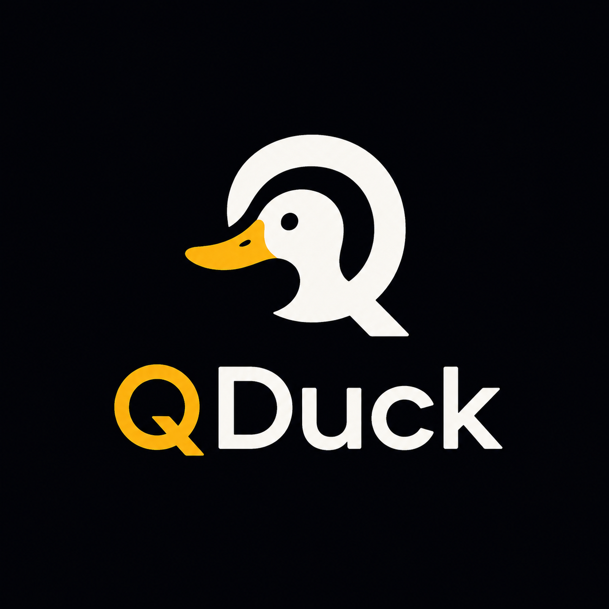

# qduck



`qduck` is a small Python encryption toolkit that makes hybrid post-quantum encryption easy to use.

It intentionally exposes only a few primitives:

1. Generate an X25519 + ML-KEM-768 hybrid keypair.
2. Client side: derive a 32-byte AES-256 key and a 1120-byte key block for the recipient.
3. Recipient side: recover the same AES-256 key from the key block.
4. Encrypt/decrypt in-memory blobs with AES-256-GCM.
5. Encrypt/decrypt files on disk with a chunked AES-256-GCM qduck file format.
 
No HTTP. No sessions. No server framework. Callers compose the primitives however they want. HTTP transport and server-framework adapters can live in separate companion packages so this core package stays dependency-light.

## Status

`qduck` is **experimental** and has **not been independently audited**. The cryptographic primitives it composes — X25519, ML-KEM-768, HKDF-SHA256, and AES-256-GCM — are standard primitives exposed by the `cryptography` package, but qduck's specific composition and file format have not undergone third-party security review.

Use at your own risk for production data.

## Install

```bash
pip install qduck
```

From a clone:

```bash
pip install -e .
```

With test tools:

```bash
pip install -e ".[dev]"
```

Or from GitHub after tagging:

```bash
pip install "qduck @ git+https://github.com/rharold1900/qduck.git@v0.2.4"
```

`qduck` requires `cryptography>=48.0.0`. `cryptography` 48.0.0 added ML-KEM key encapsulation support for OpenSSL 3.5.0+ and notes that the PyPI wheels expose post-quantum algorithms to wheel users. If your environment builds `cryptography` from source against an older or unusual crypto backend, ML-KEM may still be unavailable at runtime; in that case `qduck` raises `QDuckError` with an upgrade/rebuild message.

## Public API

Use the package root:

```python
import qduck
```

Or import from the facade:

```python
from qduck.api import derive_key, encrypt_blob
```

Public calls:

```python
qduck.generate_keypair() -> tuple[bytes, bytes]
qduck.save_keypair(public_path: str, private_path: str, force: bool = False) -> None
qduck.load_public_key(path: str) -> bytes
qduck.load_private_key(path: str) -> bytes

qduck.derive_key(public_key: bytes) -> tuple[bytes, bytes]
qduck.recover_key(private_key: bytes, key_block: bytes) -> bytes

qduck.encrypt_blob(data: bytes, aes_key: bytes, aad: bytes | None = None) -> bytes
qduck.decrypt_blob(ciphertext: bytes, aes_key: bytes, aad: bytes | None = None) -> bytes

qduck.encrypt_file(src_path: str,
                   dst_path: str,
                   aes_key: bytes,
                   aad: bytes | None = None,
                   overwrite: bool = False,
                   chunk_size: int = 1024 * 1024,
                   key_block: bytes | None = None) -> None

qduck.decrypt_file(src_path: str,
                   dst_path: str,
                   aes_key: bytes,
                   aad: bytes | None = None,
                   overwrite: bool = False) -> None

qduck.decrypt_file_with_private_key(src_path: str,
                                    dst_path: str,
                                    private_key: bytes,
                                    aad: bytes | None = None,
                                    overwrite: bool = False) -> None

qduck.QDuckError
qduck.DecryptionError
qduck.KeyFormatError
```

Internally, `qduck/api.py` is the public facade. `qduck/crypto.py` is the only module that imports from `cryptography`.

## Key generation

```bash
qduck-keygen --public public.key --private private.key
```

The private key file is created atomically with `0o600` permissions. The public key is created atomically with `0o644` permissions. Existing files are refused unless `--force` is passed.

## Minimal blob usage

```python
import qduck

qduck.save_keypair("public.key", "private.key")

public_key = qduck.load_public_key("public.key")
aes_key, key_block = qduck.derive_key(public_key)

ciphertext = qduck.encrypt_blob(
    b"the contents of my secret message",
    aes_key,
    aad=key_block,
)

private_key = qduck.load_private_key("private.key")
server_aes_key = qduck.recover_key(private_key, key_block)
plaintext = qduck.decrypt_blob(ciphertext, server_aes_key, aad=key_block)
```

## Minimal file usage: external key block

```python
import qduck

public_key = qduck.load_public_key("public.key")
aes_key, key_block = qduck.derive_key(public_key)

qduck.encrypt_file(
    "message.txt",
    "message.txt.qduck",
    aes_key,
    aad=key_block,
)

private_key = qduck.load_private_key("private.key")
server_aes_key = qduck.recover_key(private_key, key_block)
qduck.decrypt_file(
    "message.txt.qduck",
    "message.recovered.txt",
    server_aes_key,
    aad=key_block,
)
```

## Minimal file usage: embedded key block

Use this when you want the encrypted file to carry the KEM handshake bytes inside the qduck header.

```python
import qduck

public_key = qduck.load_public_key("public.key")
aes_key, key_block = qduck.derive_key(public_key)

qduck.encrypt_file(
    "message.txt",
    "message.txt.qduck",
    aes_key,
    aad=key_block,
    key_block=key_block,
)

private_key = qduck.load_private_key("private.key")
qduck.decrypt_file_with_private_key(
    "message.txt.qduck",
    "message.recovered.txt",
    private_key,
    aad=key_block,
)
```

Embedding the `key_block` does **not** embed the private key or plaintext AES key. It only embeds the public KEM ciphertext/ephemeral-public material needed by the private-key holder to recover the AES key.

## File format summary

`encrypt_file()` uses qduck file format v3. It is chunked and does not load the whole file into memory.

The header includes magic bytes, version, flags, total `header_len`, algorithm IDs, plaintext chunk size, per-file base nonce, and optional embedded key block.

Each chunk stores a 4-byte ciphertext-length/final-flag prefix plus `ciphertext || AES-GCM tag`. The per-chunk nonce is recomputed as:

```text
8-byte random base nonce || 4-byte chunk counter
```

The nonce is not stored per chunk. Every chunk authenticates its header bytes, chunk counter, final-chunk flag, and caller-provided AAD. This catches header tampering, chunk payload corruption, chunk reordering, missing final chunks, and trailing bytes after the final chunk.

Outputs are written via a sibling temp file plus atomic rename. Encrypted output is created with `0o644`; decrypted output is created with `0o600`. Existing destinations are refused unless `overwrite=True` is passed.

Default chunk size is 1 MiB. Supported chunk sizes are 4 KiB through 64 MiB.

## Examples

```bash
python examples/roundtrip.py
python examples/simple_blob.py
python examples/file_roundtrip.py
python examples/simple_file.py

qduck-keygen --force --public public.key --private private.key
echo "the contents of my secret message" > message.txt
python examples/client.py
python examples/server.py

python examples/folder_roundtrip.py ./source ./encrypted ./decrypted
```

The client/server and folder examples are caller code showing how to compose qduck primitives. They are not extra library APIs.

## Tests

```bash
pip install -e ".[dev]"
pytest tests/
```

Important test groups include blob roundtrip, file roundtrip, folder roundtrip, tamper failure, chunked file corruption checks, and embedded-key-block decrypt convenience API.

## Sizes

| Item | Size |
|---|---:|
| Public key | 1216 bytes |
| Private key | 96 bytes |
| Key block | 1120 bytes |
| AES key | 32 bytes |
| AES-GCM nonce | 12 bytes |
| AES-GCM tag | 16 bytes |
| qduck v3 fixed file header | 28 bytes |

The public key is:

```text
ML-KEM-768 public key (1184) || X25519 public key (32)
```

The private key is:

```text
ML-KEM-768 private seed (64) || X25519 private key (32)
```

The key block is:

```text
ML-KEM-768 ciphertext (1088) || X25519 ephemeral public key (32)
```

For blob encryption, output is:

```text
nonce (12) || ciphertext || tag (16)
```

For file encryption, see `qduck/file_format.py` for the exact v3 framing.

## Why hybrid?

A hybrid construction keeps both a classical and a post-quantum component. The final AES-256 key is derived from both X25519 and ML-KEM-768 shared secrets. If ML-KEM has an undiscovered flaw, X25519 still contributes protection. If future quantum computers break X25519, ML-KEM still contributes protection.

## Security notes

- AES-GCM requires nonce uniqueness per AES key. `encrypt_blob()` automatically generates a fresh random 12-byte nonce per call. `encrypt_file()` uses a fresh per-file base nonce plus a per-chunk counter.
- Public key authenticity is the caller's responsibility. `qduck` performs key exchange but does not authenticate public keys. An attacker who can substitute the recipient's public key with their own can read traffic. Authenticate public keys out of band before passing them to `derive_key()`.
- `qduck` does not provide transport security, identity, sessions, replay protection, certificate validation, password-based encryption, or private-key management.
- Reusing one derived AES key for many blobs/files is possible, but your application must manage session lifetime, process boundaries, replay behavior, and nonce-risk assumptions. A conservative pattern is to derive a fresh AES key per file or per short-lived session.
- `aad=key_block` is recommended when the key block is part of the application protocol. It cryptographically binds ciphertexts to the handshake bytes that produced the AES key.

## Packaging / release checklist

Before publishing to PyPI:

```bash
# Remove macOS and build artifacts first
find . -name ".DS_Store" -delete
find . -name "__MACOSX" -type d -prune -exec rm -rf {} +
rm -rf build dist *.egg-info .pytest_cache
find . -name "__pycache__" -type d -prune -exec rm -rf {} +

# Build, check, test
python -m pip install --upgrade build twine
python -m build
python -m twine check dist/*
pytest tests/
```

Then publish first to TestPyPI if desired, then to PyPI.

## License

Copyright 2026 Rick Harold

Licensed under the Apache License, Version 2.0. See [LICENSE](LICENSE) for the full text and [NOTICE](NOTICE) for attribution requirements.

In short: you may use, modify, and redistribute `qduck` for any purpose, including commercial use, but you must retain the copyright notice, the license text, and the `NOTICE` file in redistributions.
